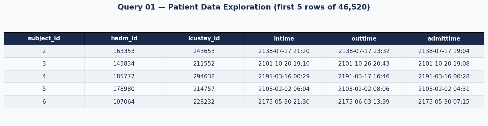
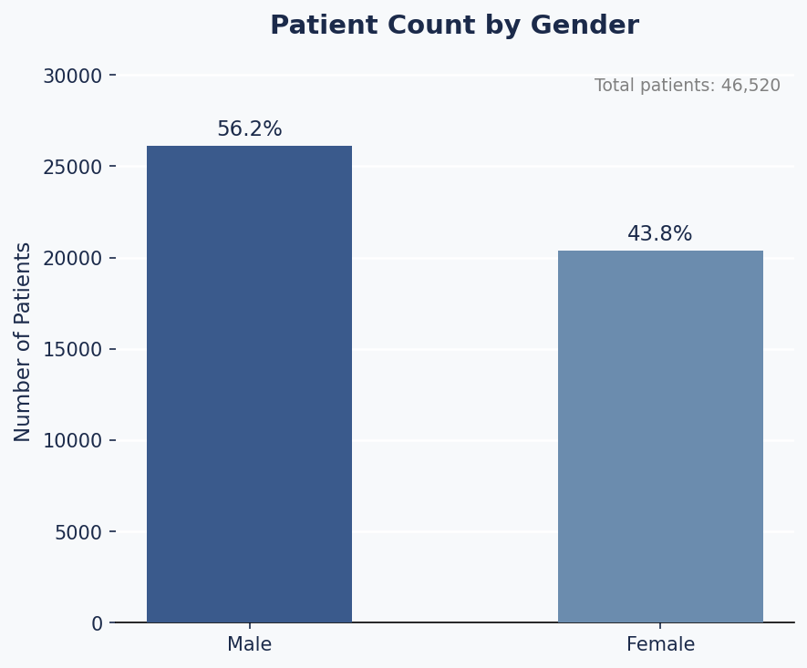
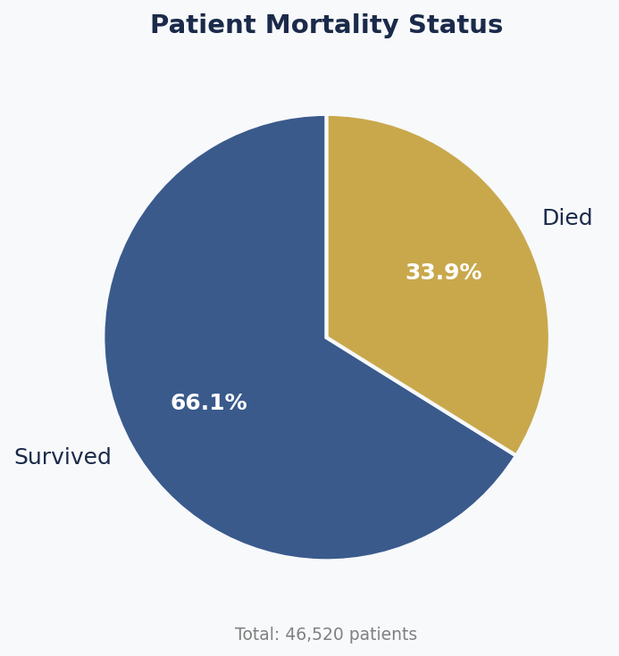
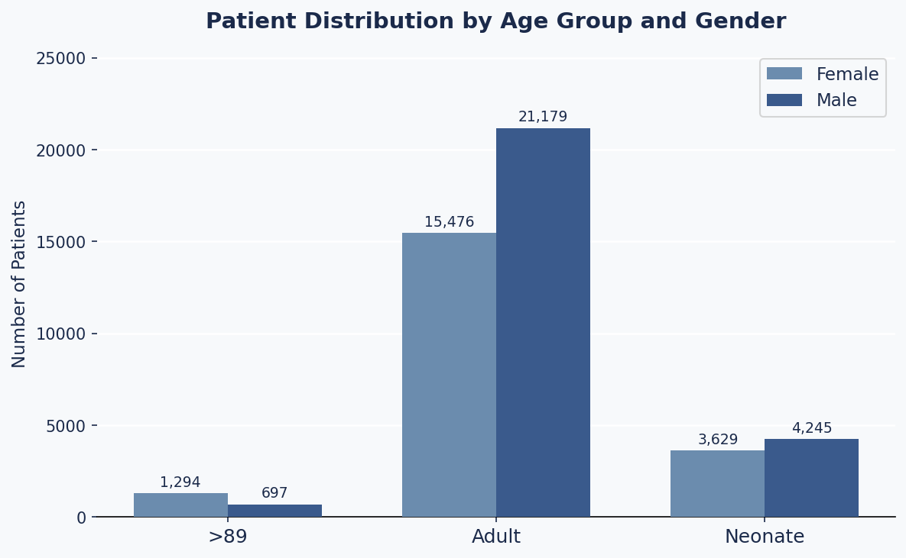
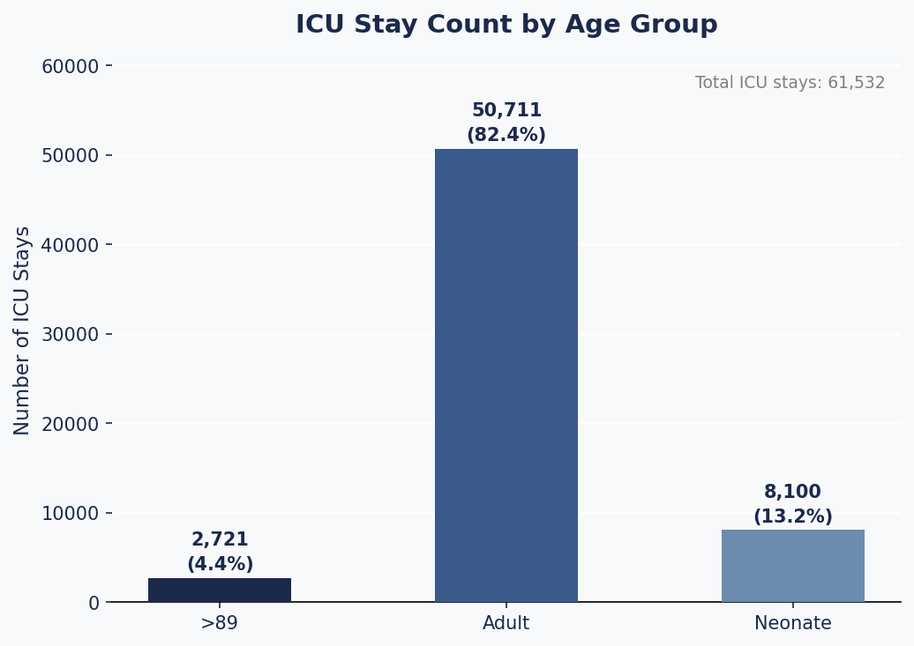
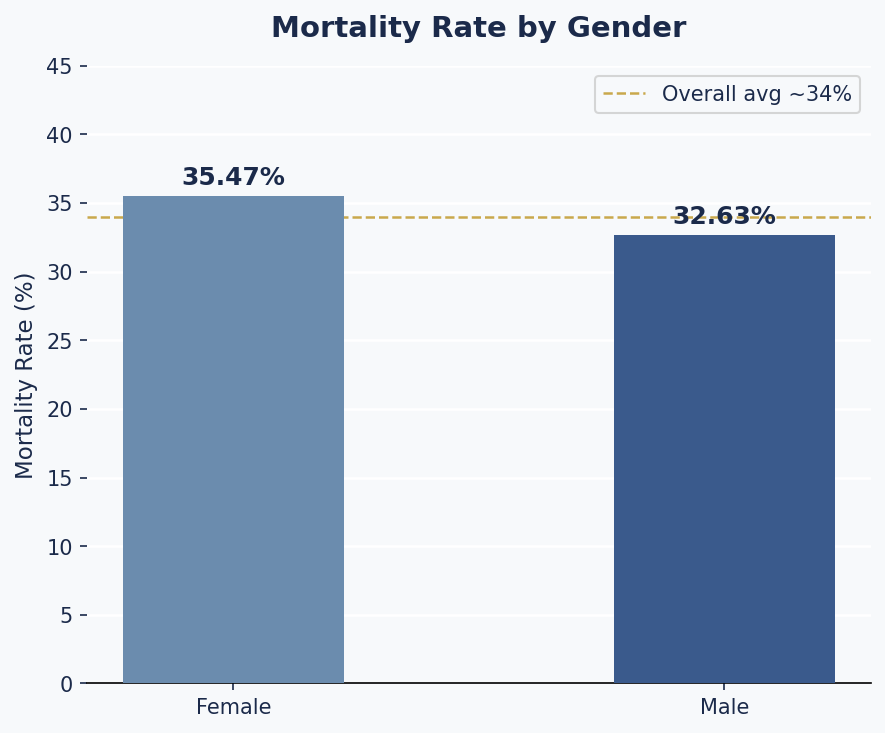
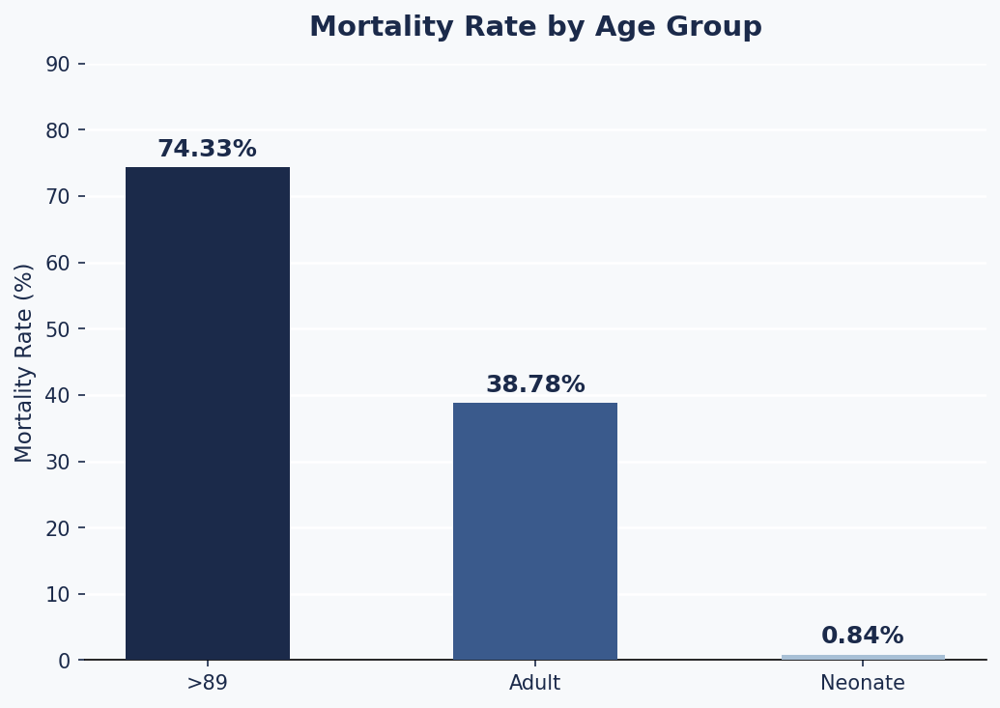
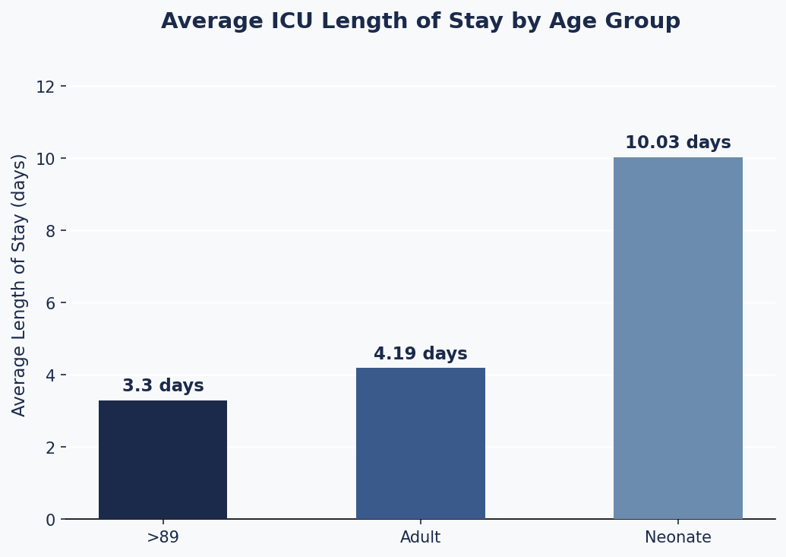

# Exploratory ICU Patient Analysis using MIMIC-III and BigQuery

## Overview
This project presents an exploratory data analysis of ICU patient data using the MIMIC-III clinical database in Google BigQuery, transforming an academic lab exercise into a portfolio-ready healthcare analytics project.

## Contents
- [Objectives](#objectives)
- [Tools Used](#tools-used)
- [Dataset](#dataset)
- [Analysis Performed](#analysis-performed)
    1. [Patient Data Exploration](#1.-patient-data-exploration)
7. [Project/Code Structure](#projectcode-structure)
8. [App Routes](#app-routes)
9. [License](#license)
10. [References](#references)
9. [Contributing](#contributing)
10. [Authors and Contributors](#authors-&-contributors)
12. [License](#license)
13. [References](#references)
14. [Additional Information](#additional-information)


## Objectives
- Explore patient demographic data
- Analyze gender distribution in ICU patients
- Evaluate mortality rates
- Study patient age groups and their distribution
- Analyze ICU stay details and pre-ICU timing
- Extend the original lab into a portfolio-level data project

## Tools Used
- Google BigQuery
- SQL
- MIMIC-III Dataset
- Microsoft Word / PDF
- (Optional) Python / Power BI for visualization

## Dataset
The MIMIC-III database is a large, publicly available dataset containing de-identified health data from ICU patients.

The analysis focuses on key tables including:
- patients
- admissions
- icustays

## Analysis Performed

### 1. Patient Data Exploration
Retrieved all patient records and key attributes such as gender, date of birth, and mortality indicators.

```sql
SELECT *
FROM `physionet-data.mimiciii_clinical.patients`
```


### 2. Gender Distribution
Analyzed the distribution of patients by gender.

```sql
SELECT 
    gender,
    COUNT(*) AS patient_count,
    ROUND(100 * COUNT(*) / SUM(COUNT(*)) OVER (), 2) AS percentage
FROM `physionet-data.mimiciii_clinical.patients`
GROUP BY gender
ORDER BY patient_count DESC;
```


### 3. Mortality Analysis
Evaluated the proportion of patients who survived vs. died during ICU stay.

```sql
SELECT
    expire_flag,
    COUNT(*) AS patient_count,
    ROUND(100 * COUNT(*) / SUM(COUNT(*)) OVER (), 2) AS percentage
FROM `physionet-data.mimiciii_clinical.patients`
GROUP BY expire_flag
ORDER BY expire_flag;
```


### 4. Age Group Analysis
Grouped patients into age categories (neonate, middle, adult, >89) and analyzed distributions.

```sql
WITH first_admission_time AS (
    SELECT
        p.subject_id,
        p.dob,
        p.gender,
        MIN(a.admittime) AS first_admittime,
        DATETIME_DIFF(MIN(a.admittime), p.dob, YEAR) AS first_admit_age
    FROM `physionet-data.mimiciii_clinical.patients` p
    INNER JOIN `physionet-data.mimiciii_clinical.admissions` a
        ON p.subject_id = a.subject_id
    GROUP BY p.subject_id, p.dob, p.gender
),
age AS (
    SELECT
        subject_id, dob, gender,
        first_admittime, first_admit_age,
        CASE
            WHEN first_admit_age > 89 THEN '>89'
            WHEN first_admit_age >= 14 THEN 'adult'
            WHEN first_admit_age <= 1  THEN 'neonate'
            ELSE 'middle'
        END AS age_group
    FROM first_admission_time
)

-- Count patients by age group and gender
SELECT
    age_group,
    gender,
    COUNT(subject_id) AS NumberOfPatients
FROM age
GROUP BY age_group, gender
ORDER BY age_group, gender;
```


### 5. ICU Stay Details
Examined ICU stay records, patient age at admission, and pre-ICU time.

```sql
SELECT
    ie.subject_id,
    ie.hadm_id,
    ie.icustay_id,
    ie.intime,
    ie.outtime,
    adm.admittime,
    DATETIME_DIFF(ie.intime, pat.dob, YEAR) AS age,
    DATETIME_DIFF(ie.intime, adm.admittime, DAY) AS preiculos,
    CASE
        WHEN DATETIME_DIFF(ie.intime, pat.dob, YEAR) > 89   THEN '>89'
        WHEN DATETIME_DIFF(ie.intime, pat.dob, YEAR) >= 14  THEN 'adult'
        WHEN DATETIME_DIFF(ie.intime, pat.dob, YEAR) <= 1   THEN 'neonate'
        ELSE 'middle'
    END AS ICUSTAY_AGE_GROUP
FROM `physionet-data.mimiciii_clinical.icustays` ie
INNER JOIN `physionet-data.mimiciii_clinical.patients` pat
    ON ie.subject_id = pat.subject_id
INNER JOIN `physionet-data.mimiciii_clinical.admissions` adm
    ON ie.hadm_id = adm.hadm_id
ORDER BY subject_id, icustay_id;
```


### 6. Additional Analysis (Extended Work)
- Mortality rate by gender
- Mortality rate by age group
- ICU stay patterns and potential risk indicators

```sql
-- 6a. Mortality rate by gender
SELECT
    gender,
    COUNT(*) AS total_patients,
    SUM(expire_flag) AS deaths,
    ROUND(100 * SUM(expire_flag) / COUNT(*), 2) AS mortality_rate_pct
FROM `physionet-data.mimiciii_clinical.patients`
GROUP BY gender
ORDER BY gender;
```


```sql
-- 6b. Mortality rate by age group
WITH age_classified AS (
    SELECT
        p.subject_id,
        p.expire_flag,
        DATETIME_DIFF(MIN(a.admittime), p.dob, YEAR) AS first_admit_age
    FROM `physionet-data.mimiciii_clinical.patients` p
    INNER JOIN `physionet-data.mimiciii_clinical.admissions` a
        ON p.subject_id = a.subject_id
    GROUP BY p.subject_id, p.expire_flag, p.dob
)
SELECT
    CASE
        WHEN first_admit_age > 89  THEN '>89'
        WHEN first_admit_age >= 14 THEN 'adult'
        WHEN first_admit_age <= 1  THEN 'neonate'
        ELSE 'middle'
    END AS age_group,
    COUNT(*) AS total_patients,
    SUM(expire_flag) AS deaths,
    ROUND(100 * SUM(expire_flag) / COUNT(*), 2) AS mortality_rate_pct
FROM age_classified
GROUP BY age_group
ORDER BY age_group;
```


```sql
-- 6c. Average ICU length of stay by age group (in days)
SELECT
    CASE
        WHEN DATETIME_DIFF(ie.intime, pat.dob, YEAR) > 89  THEN '>89'
        WHEN DATETIME_DIFF(ie.intime, pat.dob, YEAR) >= 14 THEN 'adult'
        WHEN DATETIME_DIFF(ie.intime, pat.dob, YEAR) <= 1  THEN 'neonate'
        ELSE 'middle'
    END AS age_group,
    COUNT(*) AS total_stays,
    ROUND(AVG(DATETIME_DIFF(ie.outtime, ie.intime, HOUR) / 24.0), 2) AS avg_los_days
FROM `physionet-data.mimiciii_clinical.icustays` ie
INNER JOIN `physionet-data.mimiciii_clinical.patients` pat
    ON ie.subject_id = pat.subject_id
GROUP BY age_group
ORDER BY age_group;
```



## Key Findings
- The ICU population shows a slight male predominance (~56%), suggesting higher ICU utilization among males
- The mortality rate (~34%) indicates a high-risk critical care population
- Adult patients represent the largest proportion of ICU admissions
- Elderly patients (>89) show distinct patterns in gender distribution
- ICU stay characteristics and pre-ICU time may influence patient outcomes and severity

## Repository Structure
```bash
mimiciii-icu-patient-analysis/
│
├── README.md
├── sql/
│   ├── 01_patient_exploration.sql
│   ├── 02_gender_distribution.sql
│   ├── 03_mortality_analysis.sql
│   ├── 04_age_group_analysis.sql
│   ├── 05_icu_stay_details.sql
│   └── 06_additional_analysis.sql
│
├── images/
│   ├── gender_distribution.png
│   ├── mortality_chart.png
│   └── age_group_chart.png
│
└── docs/
    └── project_report.pdf
```

## Limitations
- This analysis is exploratory and does not establish causality
- Age calculations may be affected by de-identification rules in MIMIC-III
- Results are based on available queried data only

## Future Improvements
- Add Power BI dashboard
- Perform predictive modeling for ICU outcomes
- Expand analysis to include diagnosis and treatment data

## How to Reproduce
1. Access Google BigQuery
2. Load the MIMIC-III dataset (physionet-data.mimiciii_clinical)
3. Run the SQL queries located in the `/sql` folder
4. Review the outputs and compare with the insights described in this project

## Author
Pamela Gatica
